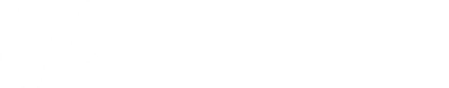

# 🟠 SE2026 Linktree — BPS Kabupaten Barru

> Halaman tautan terpusat untuk kegiatan **Sensus Ekonomi 2026**  
> BPS Kabupaten Barru · Sulawesi Selatan

---

## 📋 Deskripsi

Halaman web satu halaman (_single-page_) bergaya **glassmorphism** yang berfungsi sebagai pusat tautan (linktree) resmi kegiatan Sensus Ekonomi 2026 di lingkungan BPS Kabupaten Barru. Didesain **mobile-first** agar nyaman diakses melalui smartphone.

---

## ✨ Fitur

- 🎨 **Glassmorphism design** — efek kaca transparan khas iOS/iPhone
- 🟠 **Tema oranye Sensus Ekonomi** — sesuai identitas visual SE2026
- 📱 **Responsif** — optimal di HP maupun desktop
- 💫 **Animasi halus** — blob background, slide-up card, shimmer hover, ripple tap
- 🖼️ **Slot logo** — kiri (BPS Barru) & kanan (Sensus Ekonomi)
- 🔗 **Link card** berkelompok per kategori
- ⚡ **Zero dependency** — murni HTML, CSS, dan vanilla JavaScript

---

## 📁 Struktur File

```
📂 project/
├── 📄 index.html       ← File utama halaman linktree
├── 🖼️ bps.png          ← Logo BPS Kabupaten Barru
├── 🖼️ se.png           ← Logo Sensus Ekonomi 2026
└── 📄 README.md        ← Dokumentasi ini
```

---

## 🚀 Cara Penggunaan

### 1. Buka Langsung

Cukup buka file `index.html` di browser. Tidak perlu server atau instalasi apapun.

```bash
# Klik dua kali file index.html
# atau buka via browser:
open index.html
```

### 2. Hosting Online (Disarankan)

Agar bisa diakses semua orang via link, upload ke salah satu platform berikut:

| Platform         | Cara                                | Biaya  |
| ---------------- | ----------------------------------- | ------ |
| **GitHub Pages** | Push ke repo → Settings → Pages     | Gratis |
| **Netlify**      | Drag & drop folder ke netlify.com   | Gratis |
| **Vercel**       | `vercel deploy` atau drag & drop    | Gratis |
| **Google Drive** | Upload → Share → "Anyone with link" | Gratis |

---

## 🖼️ Mengganti Logo

Logo ditempatkan di sudut kiri atas (BPS Barru) dan kanan atas (SE2026).

1. Siapkan file gambar logo: `bps.png` dan `se.png`
2. Letakkan di folder yang sama dengan `index.html`
3. Gambar sudah langsung terbaca — tidak perlu mengubah kode

> **Format yang disarankan:** PNG dengan background transparan, ukuran minimal 100×100px

Jika ingin menggunakan nama file berbeda, ubah bagian ini di `index.html`:

```html
<!-- Logo BPS (kiri atas) -->


<!-- Logo SE (kanan atas) -->

```

---

## 🔗 Menambah atau Mengubah Link

Cari blok `<a class="link-card" ...>` di dalam `index.html`. Setiap kartu link memiliki struktur:

```html
<a class="link-card" href="URL_TUJUAN" target="_blank" rel="noopener">
  <div class="link-icon">EMOJI</div>
  <div class="link-text">
    <div class="link-title">Judul Link</div>
    <div class="link-desc">Deskripsi singkat</div>
  </div>
  <div class="link-arrow">...</div>
</a>
```

Ganti `URL_TUJUAN` dengan URL yang diinginkan, misalnya:

```html
href="https://drive.google.com/..." href="https://wa.me/628123456789"
href="https://barru.bps.go.id"
```

---

## 📂 Kategori Link yang Tersedia

| Kategori                    | Isi                                                  |
| --------------------------- | ---------------------------------------------------- |
| 📌 **Materi Pembelajaran**  | Bahan tayang & instrumen kuesioner                   |
| 📑 **Berkas dan Informasi** | Jadwal, alokasi petugas, surat undangan, tata tertib |

Untuk menambah kategori baru, salin blok berikut sebelum tag `</div>` penutup `.page`:

```html
<div class="divider"></div>
<div class="section-label">🏷️ Nama Kategori Baru</div>
<div class="links-group">
  <!-- taruh link-card di sini -->
</div>
```

---

## 🎨 Kustomisasi Warna

Warna utama dikelola via CSS variables di bagian `:root {}`:

```css
:root {
  --orange-core: #e8621a; /* Oranye utama */
  --orange-deep: #c94e0e; /* Oranye gelap */
  --orange-bright: #ff7a2f; /* Oranye terang */
  --glass-bg: rgba(255, 255, 255, 0.12); /* Transparansi kaca */
  --glass-border: rgba(255, 255, 255, 0.28); /* Border kaca */
}
```

---

## 📱 Kompatibilitas

| Platform             | Status   |
| -------------------- | -------- |
| Chrome (Android/iOS) | ✅ Penuh |
| Safari (iPhone)      | ✅ Penuh |
| Firefox              | ✅ Penuh |
| Samsung Internet     | ✅ Penuh |
| Chrome Desktop       | ✅ Penuh |

> Efek `backdrop-filter` (blur kaca) memerlukan browser modern. Pada browser lama, kartu tetap tampil normal tanpa efek blur.

---

## 👨‍💻 Dibuat oleh

**BPS Kabupaten Barru** · Sensus Ekonomi 2026  
Sulawesi Selatan, Indonesia

---

_Terakhir diperbarui: Mei 2026_
